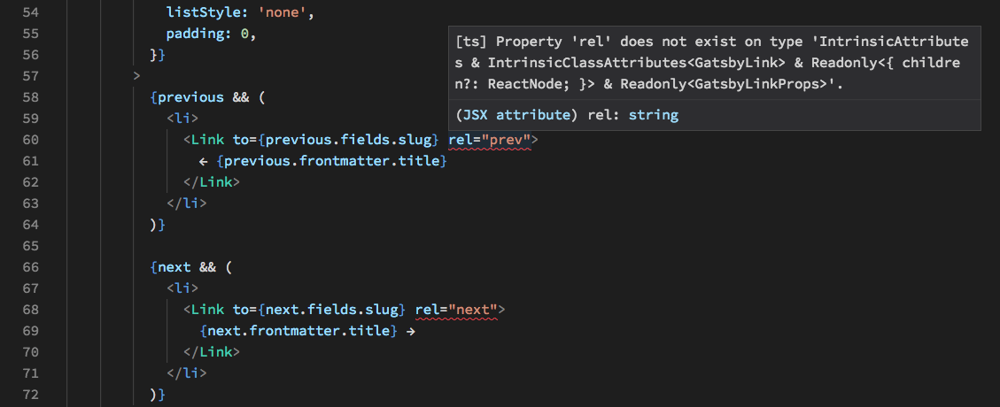
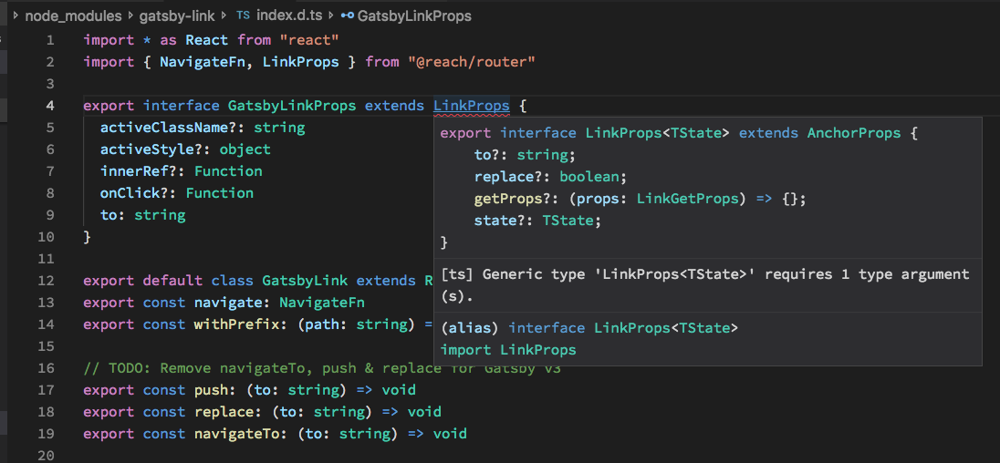

# gatsby-typescript-blog
(Originally created by Gatsby starter for creating a blog:

`gatsby new gatsby-typescript-blog https://github.com/gatsbyjs/gatsby-starter-blog#v2`

Open `src/templates/blog-post.tsx` (e.g. with Visual Studio Code) to see these error messages:

Cmd-click on `Link` to open the Typescript definition file for the `Link` tag, and you'll find another error message:

